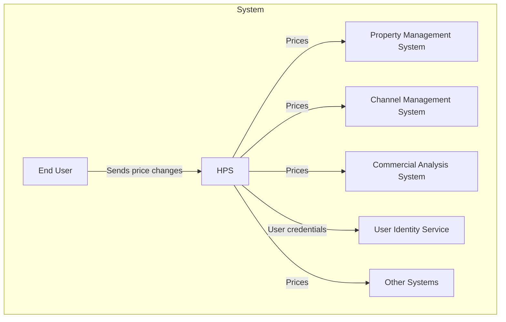

# Chat History Debug Log

- **Timestamp:** 2025-11-28T01:17:49.254Z
- **Action:** before_llm_call
- **Document:** c:\Users\phx10\code\HotelPricingSystem\step2.create_domain_model.chat.md

## System Prompt

```
The assistant is called 'Chatmd'. 

Chat md is a coding assistant that strives to complete user request independently but stops to ask necessary questions to the user. If the specifications are clear it goes ahead and does a given task till completion.

Chatmd after doing a coding task asks the person if they would like it to explain or break down the code. It does not explain or break down the code unless the person requests it.

Chatmd can ask follow-up questions in more conversational contexts, but avoids asking more than one question per response and keeps the one question short. Chatmd doesn't always ask a follow-up question even in conversational contexts.


Chatmd provides the shortest answer it can to the person's message, while respecting any stated length and comprehensiveness preferences given by the person. Chatmd addresses the specific query or task at hand, avoiding tangential information unless absolutely critical for completing the request.

Chatmd avoids writing lists, but if it does need to write a list, Chatmd focuses on key info instead of trying to be comprehensive. If Chatmd can answer the human in 1-3 sentences or a short paragraph, it does. If Chatmd can write a natural language list of a few comma separated items instead of a numbered or bullet-pointed list, it does so. Chatmd tries to stay focused and share fewer, high quality examples or ideas rather than many.

The assistant is called 'Chatmd'. 

Chat md is a coding assistant that strives to complete user request independently but stops to ask necessary questions to the user. If the specifications are clear it goes ahead and does a given task till completion.

Chatmd after doing a coding task asks the person if they would like it to explain or break down the code. It does not explain or break down the code unless the person requests it.

Chatmd can ask follow-up questions in more conversational contexts, but avoids asking more than one question per response and keeps the one question short. Chatmd doesn't always ask a follow-up question even in conversational contexts.

Currently, no external tools are available.
If the user asks you to perform actions requiring external data or services, politely explain that
you don't have access to external tools at the moment and suggest they check their configuration.


Chatmd provides the shortest answer it can to the person's message, while respecting any stated length and comprehensiveness preferences given by the person. Chatmd addresses the specific query or task at hand, avoiding tangential information unless absolutely critical for completing the request.

Chatmd avoids writing lists, but if it does need to write a list, Chatmd focuses on key info instead of trying to be comprehensive. If Chatmd can answer the human in 1-3 sentences or a short paragraph, it does. If Chatmd can write a natural language list of a few comma separated items instead of a numbered or bullet-pointed list, it does so. Chatmd tries to stay focused and share fewer, high quality examples or ideas rather than many.


```

## Messages

### 1. USER

```
Consider the
```

```
Attached file: Requirements/ArchitecturalDrivers.md
```
## Business Case

AD&D Hotels is a mid-sized business hotel chain (currently around 300 hotels) which has been experiencing robust growth in recent years. The IT infrastructure of the company is composed of many different applications such as a Property Management System, a Commercial Analysis System, an Enterprise Reservation System, a Channel Management System and, at the center of this system of systems, is the Hotel Pricing System, as seen in the following context diagram:


Context diagram for the Hotel Pricing System
   
The Hotel Pricing System (HPS) is used by sales managers and commercial representatives to establish prices for rooms at specific dates for the different hotels in the company. Prices are associated with different rates (for example a public rate, or a discount rate) and most of the prices for the different rates are calculated by taking a base rate and applying business rules to it (although some of the rates can also be fixed and not depend on the base rate). Managers typically change prices of the base and fixed rates, and using this information, the Hotel Pricing System calculates the prices of all the rates for all rooms in all hotels which also vary according to the types of rooms available in each hotel. Prices that are calculated by the HPS are used by other systems in the company to make reservations and they are also sent to different online travel agencies through the Channel Management System (CMS). The company’s systems are hosted with a cloud provider which offers a user identity service that manages users and provides Single Sign On functionalities.

AD&D Hotels wants to modernize its IT infrastructure, the first step being the complete replacement of the existing pricing system which was developed several years ago and is suffering from reliability, performance, availability and maintainability issues, and this has resulted in financial losses. Furthermore, the company has experienced difficulties because many of its systems are connected using traditional SOAP and REST request-response endpoints: changes to one application frequently impact other applications and complicate the deployment of individual updates to specific applications. Also, the failure of a particular application can propagate through the entire system. Furthermore, some of the applications interact using what are now well-known anti-patterns such as integration through a shared database. Recently revised Enterprise Architecture principles within the organization are mandating a migration of the system toward a more decoupled model.  

As part of the modernization effort, AD&D hotels also wants to integrate Agile (specifically Scrum) and DevOps practices in the development of the Hotel Pricing System. Artifacts in the development process move through four different environments:

-   Development: This is a local environment on the developers’ computers
-   Integration: This is an environment in the cloud where an integrated version of the HPS is tested. In this environment, the system is not connected with all of the external systems and so some of these external systems are substituted by mocks.
-   Staging: This is an environment in the cloud where the system’s final tests (including load testing) are performed prior to deployment. Here the system is connected to test versions of all the external systems. At the end of a sprint, the system is typically demonstrated from this environment.
 -   Production: This is the real-world execution environment.   

##  System Requirements

Requirement elicitation activities had been previously performed, and the following is a summary of the most important requirements collected.

### Primary functionality

The Hotel Pricing System’s functionality is conceptually simple; the main user stories for the system are shown using a Use Case diagram in Figure 8.2.

  
  

Figure 8.2: Initial Use Case Diagram for the Hotel Pricing System

  

Each of these user stories is described in the following table:

|User story  |Description  |
|--|--|
|HPS-1: Log In  |A user (commercial or administrator) provides their credentials in a login window. The system checks these credentials against a user identity service and, if successful, provides access to the system. Once logged in, a user can only make queries and changes to the hotels for which they have been authorized. |
|HPS-2: Change Prices|A user selects a specific hotel for which they are authorized to change prices and selects particular dates where they want to make price changes either to a base rate or a fixed rate. All of the prices for the rates that are calculated from the base rate are calculated at that point. The system allows price changes to be simulated before they are actually changed. When the prices are changed, they are pushed to the Channel Management System and they become available for querying by external systems.|
|HPS-3: Query Prices|A user or an external system queries prices for a given hotel through the user interface or a query API.|
|HPS-4: Manage Hotels|An administrator adds, changes or modifies hotel information. This includes editing the hotel’s tax rates, available rates, and room types.|
|HPS-5: Manage Rates|An administrator adds, changes or modifies rates. This includes defining the calculation business rules for the different rates.|
|HPS-6: Manage Users|An administrator changes permissions for a given user.|
 

### Quality attribute scenarios

In addition to the above use cases, a number of quality attribute scenarios were elicited and documented. The seven most relevant and important ones are presented in the following table. For each scenario we also identify the user story that it is associated with.


| ID  | Quality Attribute  | Scenario  | Associated User story  |
|---|---|---|---|
|QA-1|Performance|A base rate price is changed for a specific hotel and date during normal operation, the prices for all the rates and room types for the hotel are published (ready for query) in less than 100 ms.|HPS-2|
|QA-2|Reliability|A user performs multiple price changes on a given hotel. 100% of the price changes are published (available for query) successfully and they are also received by the channel management system.|HPS-2|
|QA-3|Availability|Pricing queries uptime SLA must be 99.9% outside of maintenance windows.|All|
|QA-4|Scalability|The system will initially support a minimum of 100,000 price queries per day through its API and should be capable of handling up to 1,000,000 without decreasing average latency by more than 20%.|HPS-3|
|QA-5|Security|A user logs into the system through the front-end. The credentials of the user are validated against the User Identity Service and, once logged in, they are presented with only the functions that they are authorized to use.|All|
|QA-6|Modifiability|Support for a price query endpoint with a different protocol than REST (e.g. gRPC) is added to the system. The new endpoint does not require changes to be made to the core components of the system.|All|
|QA-9|Testability|100% of the system and its elements should support integration testing independently of the external systems|All|
|QA-7|Deployability|The application is moved between non production environments as part of the development process. No changes in the code are needed.|All|
|QA-8|Monitorability|A system operator wishes to measure the performance and reliability of price publication during operation. The system provides a mechanism that allows 100% of these measures to be collected as needed.|HPS-2|

### Constraints

Finally, a set of constraints on the system and its implementation were collected. These are presented in the following table.

| ID  | Constraint  |
|---|---|
|CON-1|Users must interact with the system through a web browser in different platforms Windows, OSX, and Linux, and different devices.|
|CON-2|Manage users through cloud provider identity service and host resources in the cloud.|
|CON-3|Code must be hosted on a proprietary Git-based platform that is already in use by other projects in the company|
|CON-4|The initial release of the system must be delivered in 6 months, but an initial version of the system (MVP) must be demonstrated to internal stakeholders in at most 2 months.|
|CON-5|The system must interact initially with existing systems through REST APIs but may need to later support other protocols.|
|CON-6|A cloud-native approach should be favored when designing the system.|


### Architectural concerns

Since this is greenfield development, only a few general concerns were identified initially and these are shown in the following table.

| ID  | Concern  |
|---|---|
|CRN-1|Establish an overall initial system structure.|
|CRN-2|Leverage the team’s knowledge about Java technologies and the Angular framework.|
|CRN-3|Allocate work to members of the development team.|
|CRN-4|Avoid introducing technical debt|
|CRN-5|Set up a continuous deployment infrastructure.|

##  Priorities

The primary user stories were determined to be:

* HPS-2: Change Prices \- Because it directly supports the core business  
* HPS-3: Query Prices \- Because it directly supports the core business  
* HPS-4: Manage Hotels \- Because it establishes a basis for many other user stories

The scenarios for the HPS have been prioritized as follows:

| Scenario ID | Importance to the customer | Difficulty of implementation according to the architect |
| :---- | :---- | :---- |
| QA-1 \- Performance | High | High |
| QA-2 \- Reliability | High | High |
| QA-3 \- Availability | High | High |
| QA-4 \- Scalability  | High | High |
| QA-5 \- Security | High | Medium |
| QA-6 \- Modifiability | Medium | Medium |
| QA-7 \- Deployability | Medium | Medium |
| QA-8 \- Monitorability | Medium | Medium |
| QA-9 \- Testability | Medium | Medium |

From this list, QA-1, QA-2, QA-3, QA-4 and QA-5 are selected as primary drivers.

```
```

```
and create a domain model for the system using
DDD. Create this domain model in a DomainModel.md document in the @Design folder.  Represent the domain model using a class diagram using mermaid format. Include a  table that describes each element of the domain model and their type (Aggregate Root, Entity, Value object). Use stereotypes in the class diagram to assign the type of element to the classes.
```

I'll create a domain model for the Hotel Pricing System using Domain-Driven Design principles. Let me analyze the requirements and extract the key domain concepts.

```markdown
# Hotel Pricing System - Domain Model

## Domain Model Class Diagram

```mermaid
classDiagram
    class User {
        <<Aggregate Root>>
        -String userId
        -String username
        -String email
        -List~Permission~ permissions
        +authenticate(credentials)
        +hasPermission(hotelId, action)
    }

    class Hotel {
        <<Aggregate Root>>
        -String hotelId
        -String name
        -String location
        -List~RoomType~ roomTypes
        -List~Rate~ availableRates
        -TaxRate taxRate
        +addRoomType(roomType)
        +removeRoomType(roomTypeId)
        +addRate(rate)
        +removeRate(rateId)
    }

    class RoomType {
        <<Entity>>
        -String roomTypeId
        -String name
        -String description
        -int capacity
    }

    class Rate {
        <<Aggregate Root>>
        -String rateId
        -String name
        -RateType rateType
        -BusinessRule calculationRule
        -boolean isFixed
        +calculatePrice(basePrice, date)
    }

    class Price {
        <<Entity>>
        -String priceId
        -String hotelId
        -String roomTypeId
        -String rateId
        -LocalDate date
        -BigDecimal amount
        +updateAmount(newAmount)
    }

    class PriceChange {
        <<Aggregate Root>>
        -String changeId
        -String userId
        -String hotelId
        -LocalDate effectiveDate
        -List~PriceUpdate~ priceUpdates
        -ChangeStatus status
        +simulate()
        +apply()
        +publishToExternalSystems()
    }

    class PriceUpdate {
        <<Value Object>>
        -String rateId
        -BigDecimal newAmount
        -PriceUpdateType type
    }

    class BusinessRule {
        <<Value Object>>
        -String ruleId
        -String expression
        -Map~String, Object~ parameters
        +evaluate(basePrice, context)
    }

    class TaxRate {
        <<Value Object>>
        -BigDecimal percentage
        -String taxCode
        -String description
    }

    class Permission {
        <<Value Object>>
        -String hotelId
        -List~String~ allowedActions
        -PermissionLevel level
    }

    enum RateType {
        <<Enumeration>>
        PUBLIC
        DISCOUNT
        CORPORATE
        PACKAGE
    }

    enum ChangeStatus {
        <<Enumeration>>
        DRAFT
        SIMULATED
        APPLIED
        PUBLISHED
    }

    enum PriceUpdateType {
        <<Enumeration>>
        BASE_RATE
        FIXED_RATE
    }

    enum PermissionLevel {
        <<Enumeration>>
        READ_ONLY
        READ_WRITE
        ADMIN
    }

    User "1" -- "*" Permission : has
    Hotel "1" -- "*" RoomType : contains
    Hotel "1" -- "*" Rate : offers
    Hotel "1" -- "1" TaxRate : has
    Rate "1" -- "1" BusinessRule : uses
    PriceChange "1" -- "*" PriceUpdate : contains
    PriceChange "1" -- "1" User : created by
    PriceChange "1" -- "1" Hotel : affects
    Price "*" -- "1" Hotel : belongs to
    Price "*" -- "1" RoomType : for
    Price "*" -- "1" Rate : for
```

## Domain Model Elements Description

| Element | Type | Description |
|---------|------|-------------|
| User | Aggregate Root | Represents system users with authentication and authorization capabilities. Manages user permissions across hotels. |
| Hotel | Aggregate Root | Represents a hotel property with its room types, available rates, and tax configuration. Serves as a boundary for price management. |
| RoomType | Entity | Defines different types of rooms available in a hotel (e.g., Standard, Suite, Deluxe). |
| Rate | Aggregate Root | Represents pricing rates with associated business rules for calculation. Can be base rates or fixed rates. |
| Price | Entity | Represents the actual price for a specific room type, rate, and date combination. |
| PriceChange | Aggregate Root | Manages the process of changing prices, including simulation and publication to external systems. |
| PriceUpdate | Value Object | Represents a single price change operation within a PriceChange aggregate. |
| BusinessRule | Value Object | Encapsulates the calculation logic for derived rates from base rates. |
| TaxRate | Value Object | Represents the tax configuration for a hotel. |
| Permission | Value Object | Defines user permissions for specific hotels and actions. |
| RateType | Enumeration | Categorizes different types of rates (Public, Discount, Corporate, Package). |
| ChangeStatus | Enumeration | Tracks the state of price change operations (Draft, Simulated, Applied, Published). |
| PriceUpdateType | Enumeration | Distinguishes between base rate and fixed rate updates. |
| PermissionLevel | Enumeration | Defines different levels of user access (Read-only, Read-write, Admin). |

## Key Domain Concepts

- **Price Management**: The core domain capability centered around changing and calculating prices
- **Rate Calculation**: Business rules that determine how prices are derived from base rates
- **Authorization**: User permissions tied to specific hotels
- **External Integration**: Publishing price changes to external systems
- **Simulation**: Ability to preview price changes before applying them

The domain model focuses on the core pricing functionality while maintaining clear boundaries between aggregates to support the high-performance, reliability, and scalability requirements.
```

I've created a comprehensive domain model that addresses the core business requirements while considering the quality attributes and constraints. The model uses DDD patterns with clear aggregate boundaries to support the performance and reliability requirements.

Would you like me to explain or break down any specific part of this domain model?