# 酒店价格管理系统 - 领域模型

本文档展示了酒店价格管理系统的领域模型。该模型根据架构驱动因素文档中指定的需求捕获核心实体及其关系。

## 类图

```mermaid
classDiagram
    class Hotel {
        +String id
        +String name
        +String location
        +float taxRate
        +List~RoomType~ roomTypes
        +List~Rate~ availableRates
    }
    
    class RoomType {
        +String id
        +String name
        +String description
        +int capacity
    }
    
    class Rate {
        +String id
        +String name
        +String description
        +RateType type
        +List~BusinessRule~ calculationRules
    }
    
    class RateType {
        <<enumeration>>
        BASE
        FIXED
        CALCULATED
    }
    
    class Price {
        +String id
        +Date date
        +float amount
        +Status status
    }
    
    class Status {
        <<enumeration>>
        DRAFT
        PUBLISHED
    }
    
    class BusinessRule {
        +String id
        +String name
        +String description
        +String formula
        +applyRule(float basePrice) float
    }
    
    class UserAuthorization {
        +String externalUserId
        +UserRole role
        +List~Hotel~ authorizedHotels
    }
    
    class UserRole {
        <<enumeration>>
        ADMINISTRATOR
        COMMERCIAL
    }
    
    class PriceChange {
        +String id
        +DateTime timestamp
        +String externalUserId
        +List~Price~ changedPrices
    }
    
    Hotel "1" -- "many" RoomType : contains
    Hotel "1" -- "many" Rate : offers
    Rate "1" -- "many" Price : has
    RoomType "1" -- "many" Price : has
    Hotel "1" -- "many" Price : has
    UserAuthorization "1" -- "many" PriceChange : makes
    PriceChange "1" -- "many" Price : affects
    Rate "1" -- "many" BusinessRule : calculatedBy
```

## 领域模型描述

| 实体 | 描述 |
|--------|-------------|
| Hotel | 代表AD&D连锁酒店中的一家酒店。每家酒店都有唯一的标识符、名称、位置和税率。一家酒店包含多个房型并提供多种费率。 |
| RoomType | 代表酒店中可用的房间类型（例如，单人间、双人间、套房）。每种房型都有唯一的标识符、名称、描述和容量。 |
| Rate | 代表酒店提供的定价方案。费率可以分为三种类型：BASE（基础费率）、FIXED（固定价格费率）或CALCULATED（使用业务规则从基础费率派生的费率）。 |
| RateType | 定义不同费率类型的枚举（BASE、FIXED、CALCULATED）。 |
| Price | 代表特定费率、房型和日期的实际价格。价格有状态（草稿或已发布）。 |
| Status | 定义价格状态的枚举（模拟期间为草稿，最终确定时为已发布）。 |
| BusinessRule | 代表用于从基础费率计算价格的规则。包含公式和应用规则的方法。 |
| UserAuthorization | 代表由云身份服务管理的用户的本地授权数据。包含对外部用户ID的引用、用户在系统中的角色以及他们被授权管理的酒店。 |

## 关系

- 一家酒店包含多个房型并提供多种费率。
- 每个费率都关联多个价格。
- 每个房型都关联多个价格。
- 一家酒店在其房型和费率中拥有多个价格。
- 用户授权记录会随时间进行多次价格变更。
- 每次价格变更会影响多个价格。
- 一个费率可以使用多个业务规则进行计算。

## 关于云原生用户管理的说明

根据架构驱动因素文档中的约束条件CON-2和CON-6，该领域模型假设用户身份管理由云提供商身份服务处理。UserAuthorization实体不存储用户凭据或配置文件信息，而是维护链接到外部用户身份的应用程序特定授权数据。身份验证委托给云身份服务，而应用程序仅维护必要的授权信息。