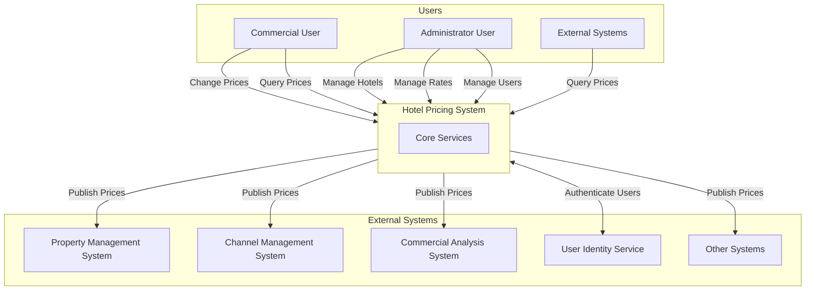
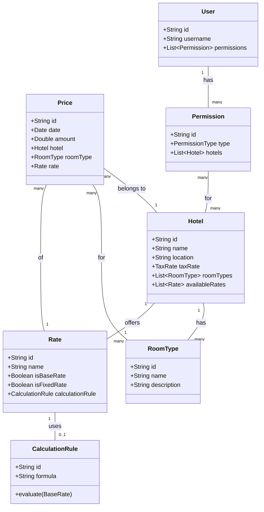
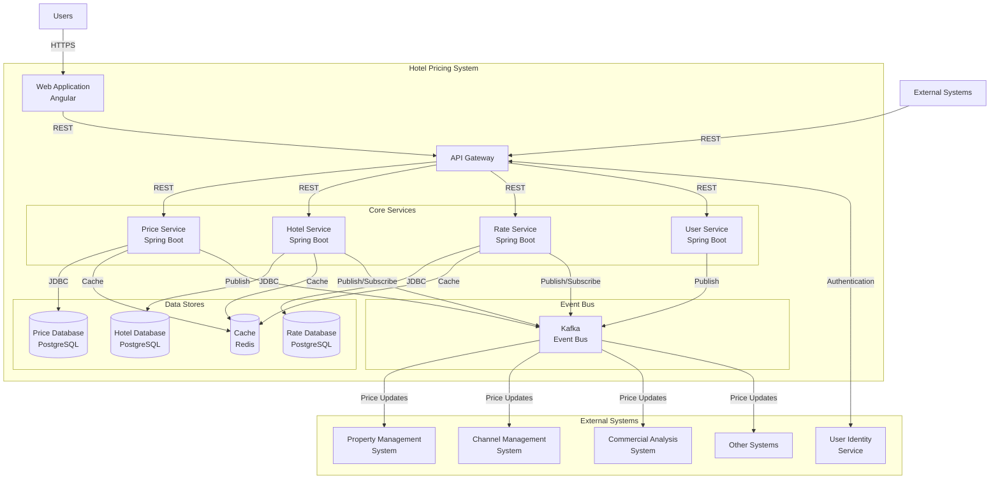
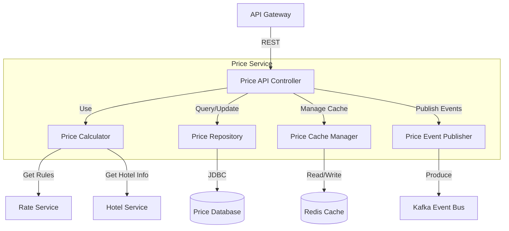
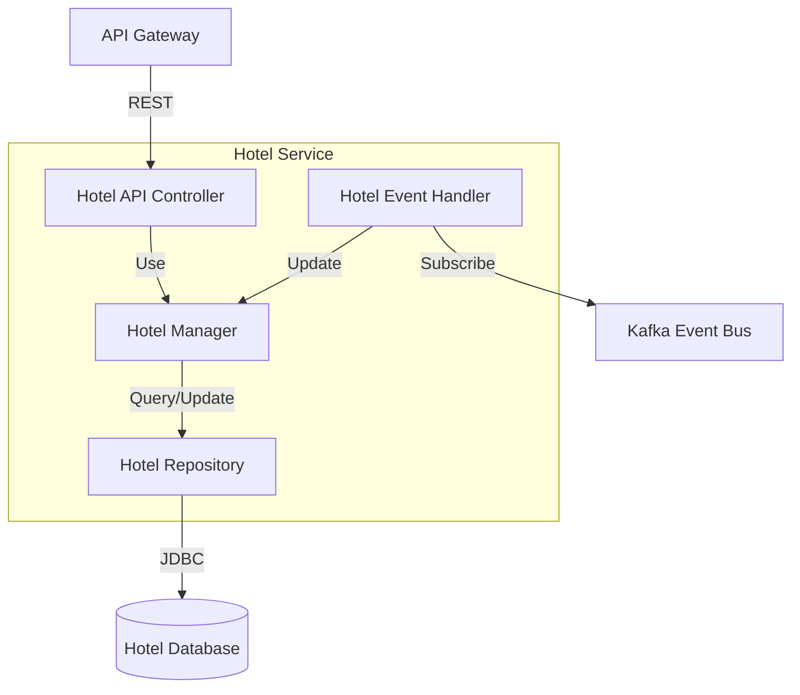
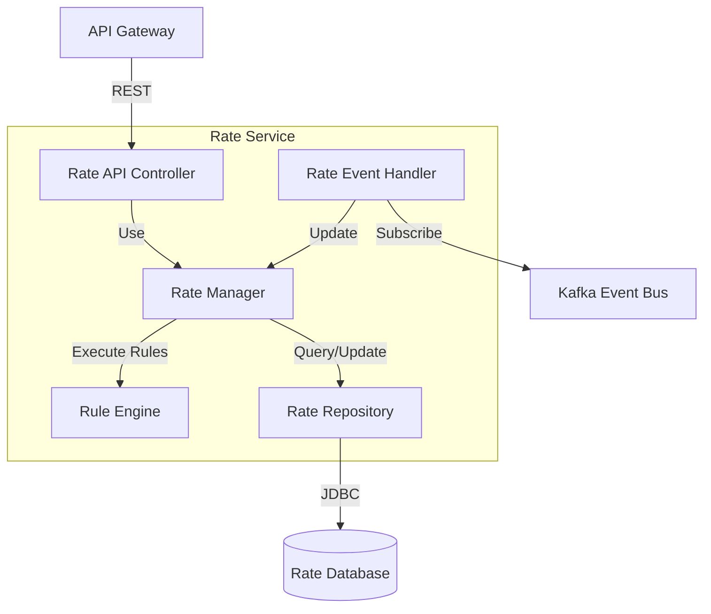
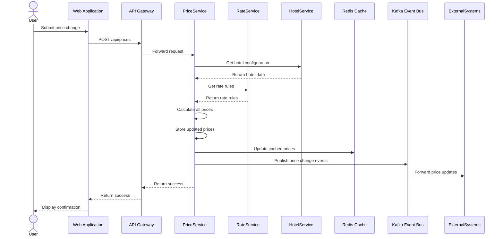
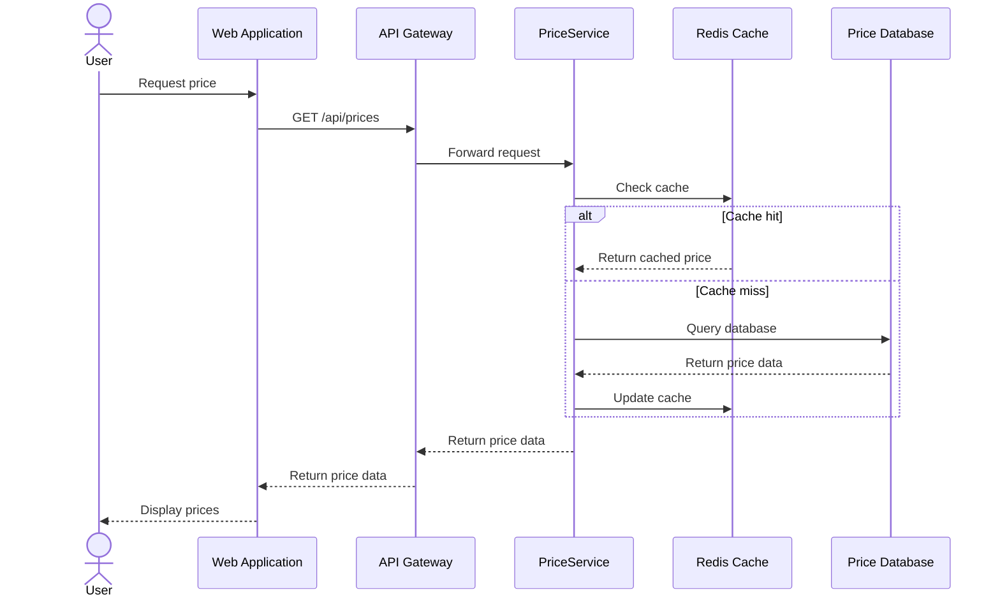

# 酒店价格管理系统（HPS）架构文档

## 1. 介绍

本文档描述了AD&D Hotels酒店价格管理系统（HPS）的架构。该架构旨在解决架构驱动因素文档中概述的业务需求、功能需求、质量属性和约束。

酒店价格管理系统是AD&D Hotels IT基础设施中的关键组件，使销售经理和商业代表能够在整个连锁酒店中建立和管理房价。系统计算不同费率和房型的价格，并将这些价格分发到公司生态系统内的其他系统。

## 2. 上下文图

下图说明了酒店价格管理系统的上下文及其与外部系统的交互：

## 3. 架构驱动因素

### 用户故事

驱动架构的主要用户故事包括：

1. **HPS-1：登录** - 通过云提供商的身份服务进行用户身份验证
2. **HPS-2：更改价格** - 修改基础/固定费率并计算派生费率的核心功能
3. **HPS-3：查询价格** - 允许用户和外部系统检索当前价格
4. **HPS-4：管理酒店** - 维护酒店数据的管理功能
5. **HPS-5：管理费率** - 定义费率计算规则的管理功能
6. **HPS-6：管理用户** - 管理用户权限的管理功能

### 质量属性场景

驱动架构的主要质量属性包括：

1. **性能（QA-1）** - 价格计算和发布在100毫秒内完成
2. **可靠性（QA-2）** - 100%成功发布价格更改
3. **可用性（QA-3）** - 价格查询的99.9%正常运行时间SLA
4. **可扩展性（QA-4）** - 支持每天10万到100万次价格查询，性能不会显著下降
5. **安全性（QA-5）** - 通过用户身份服务进行适当的身份验证和授权

其他质量属性包括可修改性、可测试性、可部署性和可监控性。

### 约束

关键约束包括：

1. **CON-1** - 跨多个平台/设备的Web浏览器界面
2. **CON-2** - 使用云提供商身份服务的云托管解决方案
3. **CON-3** - 与专有基于Git的平台集成
4. **CON-4** - 6个月交付时间表，2个月MVP
5. **CON-5** - 初始REST API集成，潜在支持其他协议
6. **CON-6** - 云原生方法

### 架构关注点

1. **CRN-1** - 建立整体初始系统结构
2. **CRN-2** - 利用团队的Java和Angular知识
3. **CRN-3** - 实现高效的工作分配
4. **CRN-4** - 避免技术债务
5. **CRN-5** - 建立持续部署基础设施

## 4. 领域模型

### 领域模型描述

- **Hotel**：代表具有相关属性的实体酒店物业
- **RoomType**：酒店中可用的不同房型
- **Rate**：提供的不同定价费率（基础费率、固定费率和计算费率）
- **CalculationRule**：基于基础费率计算费率的业务规则
- **Price**：特定酒店、房型、费率和日期的实际价格
- **User**：具有权限的系统用户
- **Permission**：特定酒店和操作的访问权限

### 关系

- 酒店拥有许多房型并提供许多费率
- 费率如果不是固定费率或基础费率，可能使用计算规则
- 价格属于特定日期的特定酒店、房型和费率
- 用户拥有适用于特定酒店的许多权限

## 5. 容器图

### 容器职责

1. **Web应用程序（Angular）**
   - 为所有系统功能提供用户界面
   - 实现响应式设计以实现跨平台兼容性
   - 通过API网关与后端服务通信

2. **API网关**
   - 所有客户端请求的单一入口点
   - 与用户身份服务管理身份验证和授权
   - 将请求路由到适当的微服务
   - 提供API文档和发现

3. **价格服务**
   - 管理所有酒店、房型和费率的价格数据
   - 实现价格计算业务逻辑
   - 处理价格查询和更新
   - 将价格更改事件发布到事件总线

4. **酒店服务**
   - 管理酒店信息和房型
   - 提供酒店配置操作
   - 对影响酒店数据的事件做出反应

5. **费率服务**
   - 管理费率定义和计算规则
   - 验证费率配置
   - 发布费率更改事件

6. **用户服务**
   - 管理酒店的用户权限
   - 与云提供商的用户身份服务接口
   - 在应用程序级别强制执行访问控制

7. **事件总线（Kafka）**
   - 实现服务间的异步通信
   - 将价格更新发布到外部系统
   - 提供事件源功能以确保可靠性

8. **数据库**
   - 价格、酒店和费率数据的独立数据库
   - 确保服务间的数据隔离

9. **缓存（Redis）**
   - 提高频繁访问数据的查询性能
   - 减少价格查询的数据库负载

## 6. 组件图

### 价格服务组件

### 酒店服务组件

### 费率服务组件

## 7. 序列图

### 更改价格序列（HPS-2）

### 查询价格序列（HPS-3）

## 8. 接口

### REST API端点

| 端点 | 方法 | 描述 | 需要身份验证 |
|----------|--------|-------------|------------------------|
| `/api/auth/login` | POST | 用户身份验证 | 否 |
| `/api/prices` | GET | 查询价格 | 是（用于管理功能） |
| `/api/prices` | POST | 更新价格 | 是 |
| `/api/hotels` | GET | 列出酒店 | 是 |
| `/api/hotels/{id}` | GET | 获取酒店详情 | 是 |
| `/api/hotels` | POST | 创建酒店 | 是（管理员） |
| `/api/hotels/{id}` | PUT | 更新酒店 | 是（管理员） |
| `/api/rates` | GET | 列出费率 | 是 |
| `/api/rates/{id}` | GET | 获取费率详情 | 是 |
| `/api/rates` | POST | 创建费率 | 是（管理员） |
| `/api/rates/{id}` | PUT | 更新费率 | 是（管理员） |
| `/api/users/{id}/permissions` | GET | 获取用户权限 | 是（管理员） |
| `/api/users/{id}/permissions` | PUT | 更新用户权限 | 是（管理员） |

### 事件模式

| 事件 | 模式 | 描述 |
|-------|--------|-------------|
| `price-changed` | `{ hotelId, roomTypeId, rateId, date, amount }` | 价格更新时发布 |
| `hotel-created` | `{ hotelId, name, ... }` | 创建酒店时发布 |
| `hotel-updated` | `{ hotelId, changedFields, ... }` | 酒店数据更新时发布 |
| `rate-created` | `{ rateId, name, isFixed, ... }` | 创建费率时发布 |
| `rate-updated` | `{ rateId, changedFields, ... }` | 费率数据更新时发布 |

## 9. 事件定义

系统使用事件驱动架构来解耦服务并确保与外部系统的可靠通信。关键事件包括：

1. **价格事件**
   - `price-changed`：价格修改时发出
   - `price-calculated`：计算派生费率时的内部事件
   - `price-published`：价格成功发布到外部系统时发出

2. **酒店事件**
   - `hotel-created`：添加新酒店时发出
   - `hotel-updated`：修改酒店信息时发出
   - `room-type-added`：向酒店添加房型时发出
   - `room-type-updated`：修改房型信息时发出

3. **费率事件**
   - `rate-created`：定义新费率时发出
   - `rate-updated`：修改费率信息时发出
   - `calculation-rule-changed`：修改费率计算规则时发出

## 10. 设计决策

### 架构风格：事件驱动架构的微服务

**决策**：采用具有事件驱动通信模式的微服务架构

**理由**：
- 通过允许服务独立运行解决QA-3（可用性）
- 通过启用组件的独立扩展解决QA-4（可扩展性）
- 通过解耦组件解决QA-6（可修改性）
- 通过允许不同的通信模式解决CON-5（协议支持）
- 通过遵循现代云架构原则解决CON-6（云原生方法）

### 技术栈

**决策**：使用Spring Boot作为后端服务，Angular作为前端，PostgreSQL作为数据存储，Redis作为缓存，Kafka作为事件消息传递

**理由**：
- 通过利用团队的Java和Angular知识解决CRN-2
- 通过Redis缓存解决QA-1（性能）
- 通过Kafka的可靠消息传递解决QA-2（可靠性）
- 通过Spring Boot的容器化支持解决QA-7（可部署性）

### 数据管理

**决策**：为每个服务实现数据库模式，并使用事件源确保数据一致性

**理由**：
- 通过消除单点故障解决QA-3（可用性）
- 通过解耦数据存储解决QA-6（可修改性）
- 避免业务案例中提到的通过共享数据库集成的反模式

### 身份验证和授权

**决策**：利用云提供商的用户身份服务，使用JWT令牌进行身份验证和基于角色的访问控制

**理由**：
- 通过使用已建立的身份验证机制解决QA-5（安全性）
- 通过与云提供商的身份服务集成解决CON-2
- 启用业务案例中提到的单点登录功能

### 部署策略

**决策**：在云提供商平台上使用Docker实现容器化和Kubernetes编排

**理由**：
- 通过基础设施即代码解决QA-7（可部署性）
- 通过Kubernetes的监控功能解决QA-8（可监控性）
- 通过启用持续部署基础设施解决CRN-5
- 通过遵循云原生原则解决CON-6

### 缓存策略

**决策**：为频繁访问的价格数据实现Redis缓存

**理由**：
- 通过减少数据库负载解决QA-1（性能）
- 通过启用更高的查询吞吐量解决QA-4（可扩展性）
- 使系统能够处理指定的每天10万到100万次查询

### API网关

**决策**：实现API网关作为客户端请求的单一入口点

**理由**：
- 通过集中身份验证解决QA-5（安全性）
- 通过将客户端与服务实现解耦解决QA-6（可修改性）
- 启用对不同协议的未来支持（CON-5）