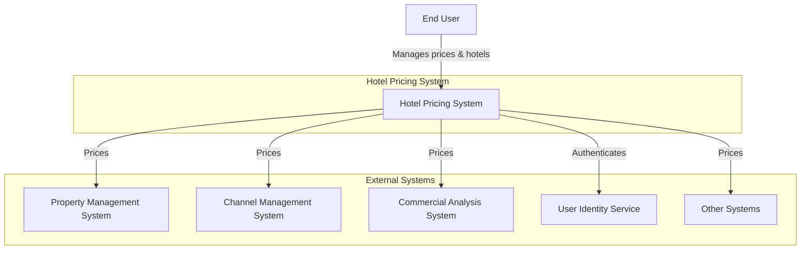
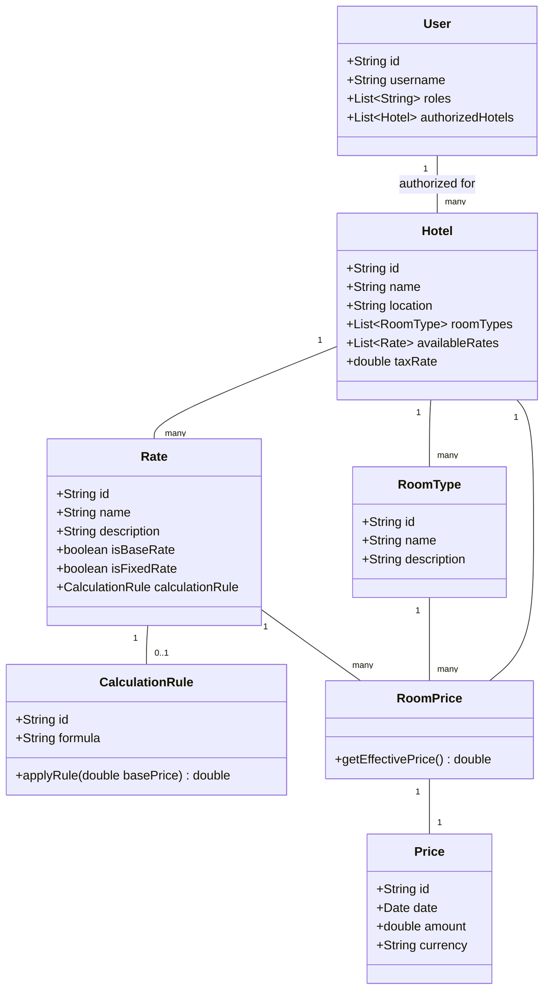
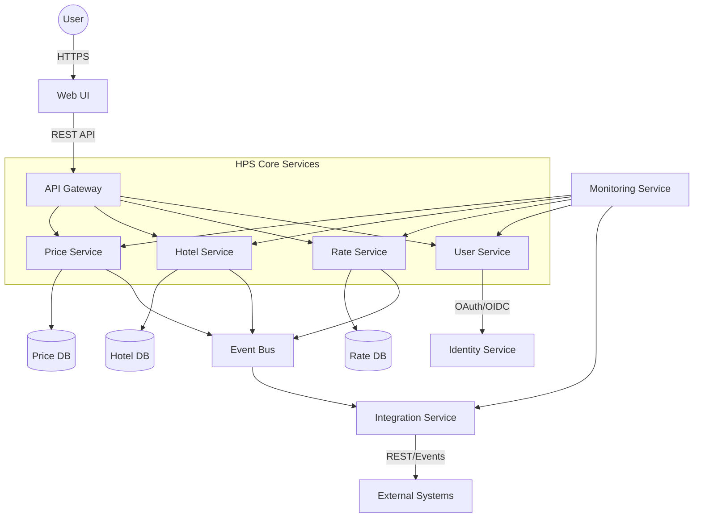
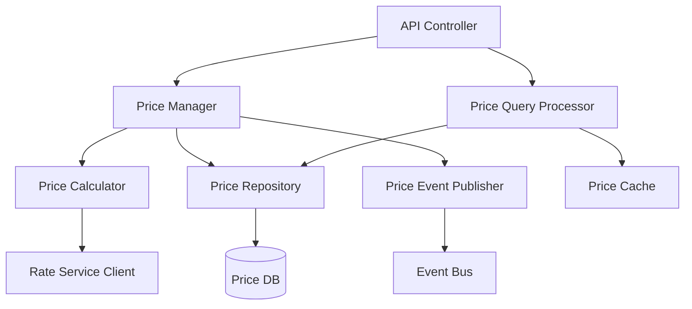
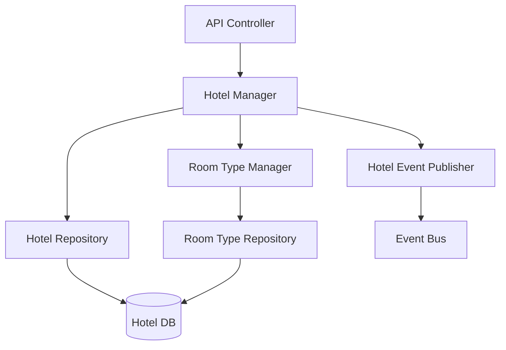
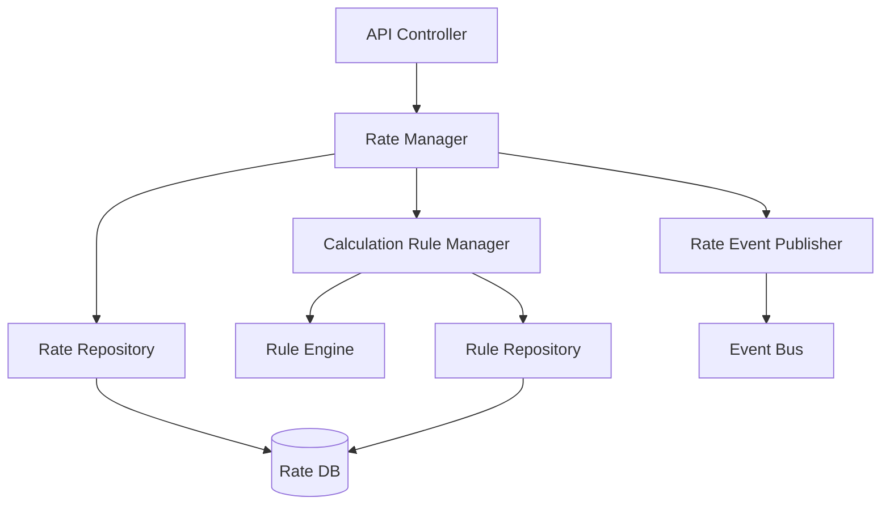
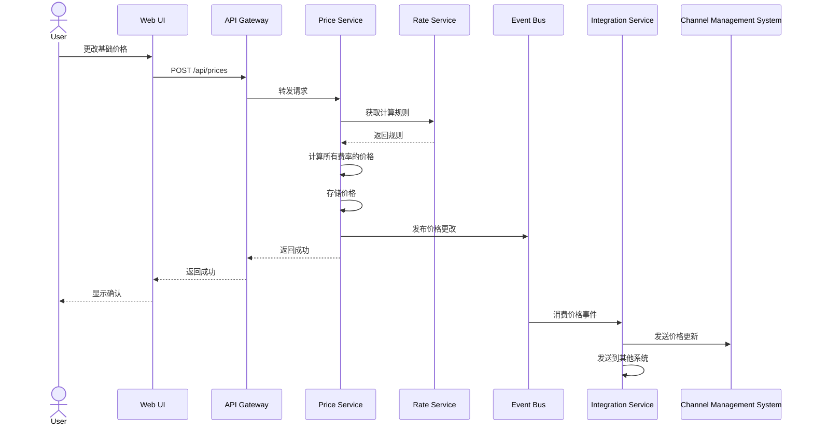
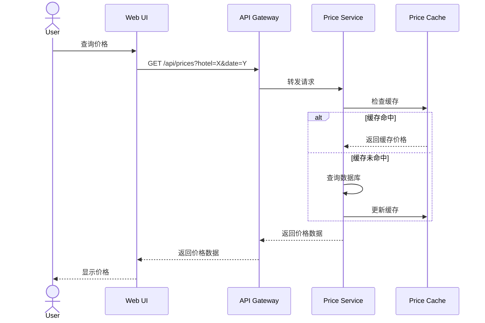

# 酒店价格管理系统（HPS）架构文档

## 1. 介绍

酒店价格管理系统（HPS）是AD&D Hotels的关键应用程序，旨在替换现有存在可靠性、性能、可用性和可维护性问题的价格系统。本文档概述了新HPS的架构，该架构将允许销售经理和商业代表在酒店连锁中为特定日期的房间制定价格。

该架构旨在满足高性能、可靠性、可扩展性和可用性要求，同时促进公司向更解耦的系统模型过渡。它采用云原生原则，并支持组织的DevOps和敏捷实践。

## 2. 上下文图

## 3. 架构驱动因素

### 用户故事

| ID     | 描述                                                   | 优先级 |
|--------|---------------------------------------------------------------|----------|
| HPS-1  | 登录 - 通过身份服务进行用户身份验证              | 中等   |
| HPS-2  | 更改价格 - 更新和模拟价格变化             | 高     |
| HPS-3  | 查询价格 - 通过UI或API检索价格                  | 高     |
| HPS-4  | 管理酒店 - 添加/修改酒店信息                  | 高     |
| HPS-5  | 管理费率 - 添加/修改费率和计算规则         | 中等   |
| HPS-6  | 管理用户 - 更改用户权限                        | 中等   |

### 质量属性场景

| ID    | 质量属性 | 场景                                                                       | 优先级 |
|-------|------------------|-------------------------------------------------------------------------------|----------|
| QA-1  | 性能      | 基础费率更改后，价格在100毫秒内计算并发布          | 高     |
| QA-2  | 可靠性      | 100%的价格更改成功发布并被CMS接收               | 高     |
| QA-3  | 可用性     | 维护窗口外价格查询的99.9%正常运行时间SLA               | 高     |
| QA-4  | 可扩展性      | 支持每天10万到100万次API查询，延迟增加不超过20%                | 高     |
| QA-5  | 安全性         | 用户身份验证后只能访问授权功能               | 高     |
| QA-6  | 可修改性    | 可以添加新协议端点而无需更改核心组件             | 中等   |
| QA-7  | 可部署性    | 在环境之间移动而无需更改代码                                 | 中等   |
| QA-8  | 可监控性   | 跟踪价格发布的性能和可靠性指标                 | 中等   |
| QA-9  | 可测试性      | 支持独立于外部系统的集成测试                    | 中等   |

### 约束

| ID     | 约束                                                                    |
|--------|-------------------------------------------------------------------------------|
| CON-1  | 支持跨Windows、OSX、Linux和各种设备的Web浏览器界面 |
| CON-2  | 使用云提供商身份服务和云托管                         |
| CON-3  | 在公司的专有基于Git的平台上托管代码                         |
| CON-4  | 在2个月内交付MVP，6个月内交付完整版本                          |
| CON-5  | 最初支持REST API，后续可能支持其他协议         |
| CON-6  | 实施云原生方法                                               |

### 架构关注点

| ID     | 关注点                                         |
|--------|------------------------------------------------|
| CRN-1  | 建立整体初始系统结构   |
| CRN-2  | 利用团队的Java和Angular知识      |
| CRN-3  | 为开发团队成员分配工作       |
| CRN-4  | 避免引入技术债务                |
| CRN-5  | 建立持续部署基础设施     |

## 4. 领域模型

### 类图

### 领域模型描述

| 实体           | 描述                                                                               |
|------------------|-------------------------------------------------------------------------------------------|
| Hotel            | 代表具有基本信息、房型和可用费率的酒店物业    |
| RoomType         | 定义酒店中可用的房型（例如，标准房、套房、豪华房）               |
| Rate             | 代表定价费率（基础费率、固定费率或计算费率）                     |
| CalculationRule  | 定义如何从基础费率派生计算费率                               |
| Price            | 代表给定日期的特定价格金额                                       |
| RoomPrice        | 将价格与特定房型、费率和酒店关联                             |
| User             | 代表具有角色和授权酒店的系统用户                                 |

### 关系

- 酒店拥有多个房型、费率和房价
- 每个费率可以是基础费率、固定费率或计算费率（带有计算规则）
- 房价将特定房型、费率和酒店链接到价格
- 用户有权管理特定酒店

## 5. 容器图

### 容器职责

| 容器           | 职责                                                                        |
|---------------------|-----------------------------------------------------------------------------------------|
| Web UI              | 基于Angular的前端，为所有系统功能提供用户界面                |
| API Gateway         | 路由请求，处理API版本控制、身份验证、速率限制和缓存     |
| Price Service       | 管理价格计算、更改和查询                                        |
| Hotel Service       | 管理酒店信息、房型和酒店特定设置                      |
| Rate Service        | 管理费率定义和计算规则                                          |
| User Service        | 管理用户授权并处理与身份服务的集成                |
| Integration Service | 处理与外部系统的通信、协议转换和事件发布 |
| Event Bus           | 提供服务间的异步通信                                    |
| Monitoring Service  | 收集指标、日志和跟踪以监控系统性能和可靠性    |
| Databases           | 存储服务特定数据                                                             |
| Identity Service    | 外部云提供商的身份验证服务                                    |

## 6. 组件图

### 价格服务组件

| 组件            | 职责                                                           |
|----------------------|----------------------------------------------------------------------------|
| API Controller       | 暴露用于价格管理和查询的REST端点                     |
| Price Manager        | 编排价格更改、计算和发布                    |
| Price Calculator     | 应用计算规则确定所有费率的价格                 |
| Price Query Processor| 使用缓存优化和处理价格查询以实现高性能       |
| Price Repository     | 管理价格的数据库操作                                      |
| Price Event Publisher| 将价格更改事件发布到事件总线                              |
| Price Cache          | 为频繁访问的价格提供内存缓存                   |
| Rate Service Client  | 与费率服务通信以获取计算规则                   |

### 酒店服务组件

| 组件            | 职责                                                           |
|----------------------|----------------------------------------------------------------------------|
| API Controller       | 暴露用于酒店管理的REST端点                                |
| Hotel Manager        | 编排酒店创建、更新和查询                          |
| Room Type Manager    | 管理酒店的房型                                              |
| Hotel Repository     | 管理酒店的数据库操作                                      |
| Room Type Repository | 管理房型的数据库操作                                  |
| Hotel Event Publisher| 将酒店更改事件发布到事件总线                             |

### 费率服务组件

| 组件               | 职责                                                        |
|-------------------------|-------------------------------------------------------------------------|
| API Controller          | 暴露用于费率管理的REST端点                              |
| Rate Manager            | 编排费率创建、更新和查询                        |
| Calculation Rule Manager| 管理费率的计算规则                                     |
| Rule Engine             | 评估计算规则                                             |
| Rate Repository         | 管理费率的数据库操作                                    |
| Rule Repository         | 管理计算规则的数据库操作                        |
| Rate Event Publisher    | 将费率更改事件发布到事件总线                           |

## 7. 序列图

### 更改价格序列（HPS-2）

此序列图显示了用户更改基础价格时的流程。价格服务使用费率服务的规则计算所有派生价格，然后通过事件总线发布更改。集成服务消费这些事件并将更新转发到外部系统，如渠道管理系统。

### 查询价格序列（HPS-3）

此序列图说明了价格查询的处理方式。系统首先检查缓存中是否有请求的价格数据。如果找到，则立即返回缓存数据，确保100毫秒以内的响应时间。如果缓存中没有，则从数据库检索并更新缓存以供将来查询。

## 8. 接口

### 外部API接口

| 接口 | 类型 | 描述 | 端点模式 |
|-----------|------|-------------|------------------|
| Price API | REST | 允许查询和更改价格 | GET /api/v1/prices POST /api/v1/prices GET /api/v1/prices/{id} |
| Hotel API | REST | 管理酒店信息 | GET /api/v1/hotels POST /api/v1/hotels PUT /api/v1/hotels/{id} |
| Rate API | REST | 管理费率和计算规则 | GET /api/v1/rates POST /api/v1/rates PUT /api/v1/rates/{id} |
| User API | REST | 管理用户权限 | GET /api/v1/users PUT /api/v1/users/{id}/permissions |

### 内部组件接口

| 服务 | 接口 | 描述 |
|---------|-----------|-------------|
| Price Service | IPriceCalculator | 根据基础费率和规则计算价格 |
| Price Service | IPriceRepository | 管理价格持久化 |
| Rate Service | IRateManager | 管理费率定义 |
| Rate Service | ICalculationRuleEngine | 评估价格计算规则 |
| Integration Service | IEventConsumer | 消费事件总线中的事件 |
| Integration Service | IExternalSystemAdapter | 为外部系统协议适配事件 |

## 9. 事件定义

| 事件 | 属性 | 发布者 | 订阅者 | 描述 |
|-------|------------|-----------|-------------|-------------|
| PriceChanged | hotelId, roomTypeId, rateId, date, newPrice | Price Service | Integration Service | 价格更改时发布 |
| HotelChanged | hotelId, changeType, details | Hotel Service | Price Service, Integration Service | 酒店信息更改时发布 |
| RateChanged | rateId, hotelId, changeType, details | Rate Service | Price Service, Integration Service | 费率或计算规则更改时发布 |

## 10. 设计决策

| 驱动因素 | 决策 | 理由 | 被淘汰的替代方案 |
|--------|----------|-----------|------------------------|
| QA-1, QA-4 | 在价格服务中实现缓存 | 缓存频繁访问的价格确保100毫秒以内的响应时间并支持高查询量 | 仅数据库方法，无法满足性能要求 |
| QA-2, QA-3 | 具有可靠消息传递的事件驱动架构 | 确保价格更新的可靠传递并有助于维护系统可用性 | 系统间的直接同步API调用，可能导致级联故障 |
| QA-3, QA-4 | 具有独立扩展的微服务架构 | 允许不同组件根据其特定负载进行扩展 | 单体架构，会限制可扩展性和可用性 |
| QA-5, CON-2 | 与云提供商的身份服务集成 | 利用云功能进行安全身份验证 | 自定义身份验证系统，会增加开发时间 |
| QA-6, CON-5 | 带协议转换的API网关 | 允许添加新协议支持而无需更改核心服务 | 客户端到服务的直接通信，需要每个服务支持协议 |
| QA-7, CRN-5 | 带Kubernetes的容器化 | 促进跨环境部署并支持DevOps实践 | 传统VM部署，灵活性较差 |
| QA-8, QA-9 | 全面的监控和测试基础设施 | 确保可以跟踪系统性能并对组件进行独立测试 | 临时监控和测试，无法提供一致的见解 |
| CRN-2 | 基于Java的后端和Angular前端 | 利用团队现有知识 | 需要培训的替代技术 |
| CRN-4 | 职责分离的清晰架构 | 通过明确分离职责避免技术债务 | 可能加快初始开发但会导致维护问题的设计捷径 |