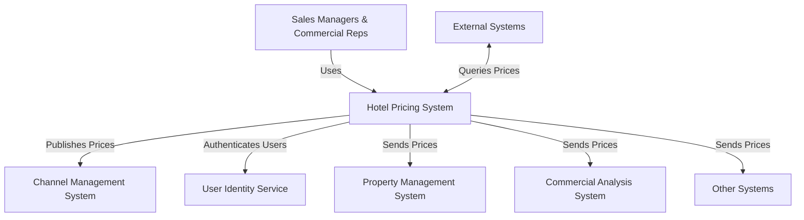
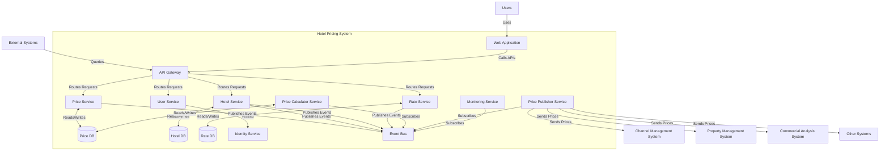
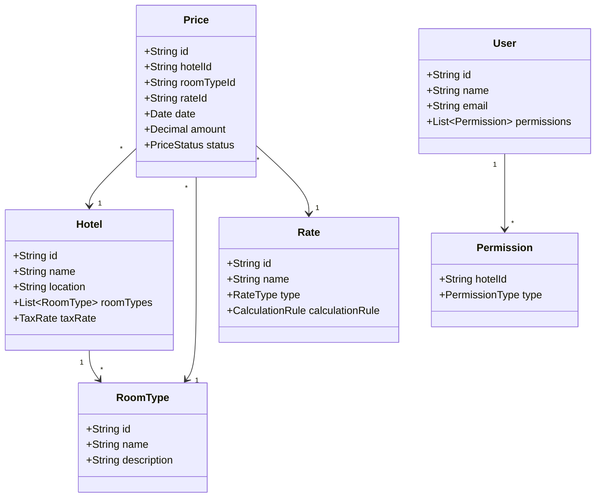
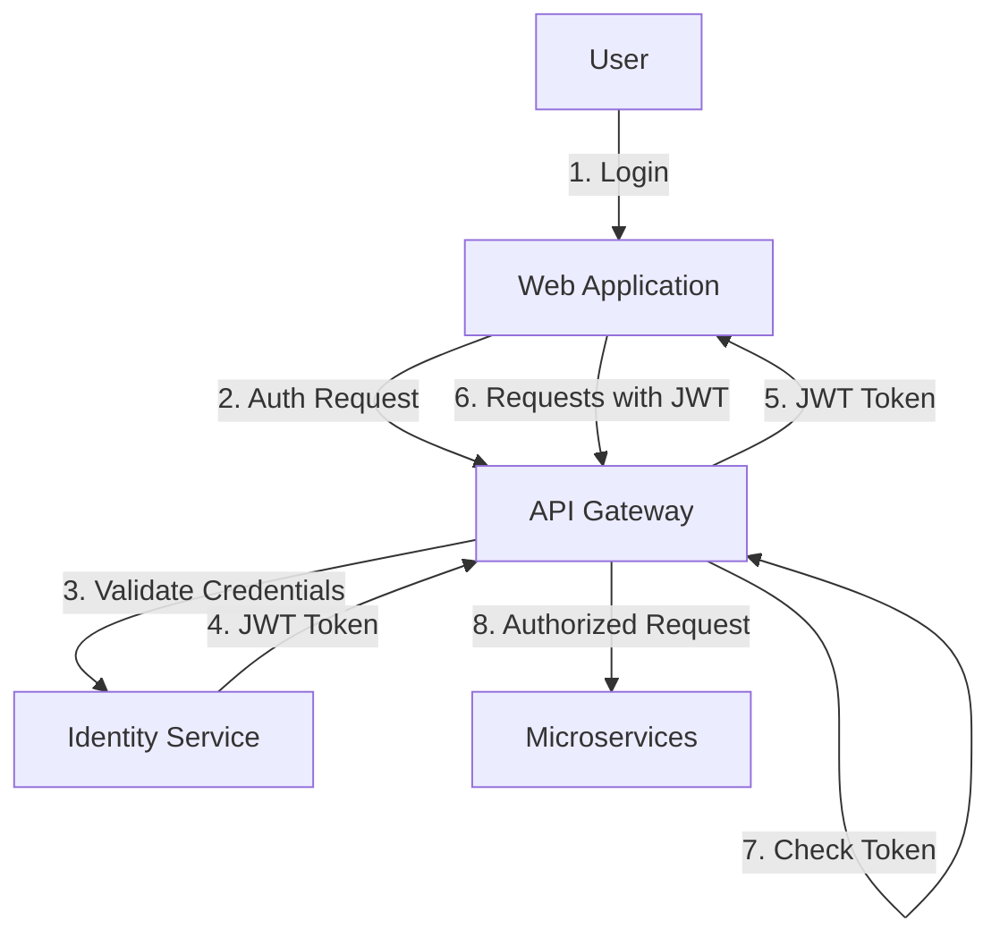
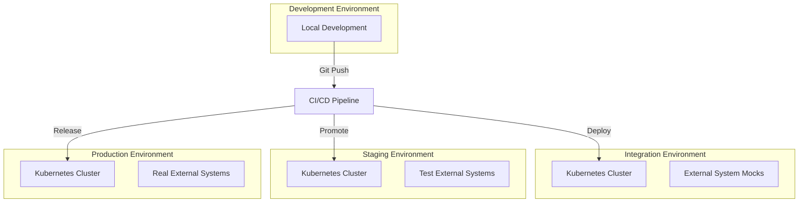

# 酒店价格管理系统（HPS）架构

## 1. 介绍

本文档描述了AD&D Hotels酒店价格管理系统（HPS）的架构。该架构旨在解决需求文档中指定的关键业务驱动因素、功能需求、质量属性和约束。

## 2. 架构方法

基于需求，我们选择了具有**云原生**方法的**事件驱动微服务架构**。该架构支持：

- 解耦系统组件以解决当前的集成问题
- 满足高可用性、可靠性和性能要求
- 可扩展性以处理可变负载
- 简化的部署和维护流程

## 3. 高级架构

### 3.1 系统上下文

### 3.2 容器图

## 4. 组件架构

### 4.1 Web应用程序

使用Angular构建的单页应用程序（SPA），提供以下用户界面：
- 酒店价格管理
- 酒店配置管理
- 费率管理
- 用户管理

### 4.2 API网关

作为客户端应用程序和外部系统的单一入口点，提供：
- 请求路由
- 协议转换
- 身份验证和授权
- 速率限制
- 请求/响应日志

### 4.3 核心服务

#### 4.3.1 价格服务
- 处理价格修改请求
- 管理价格数据
- 发布价格更改事件

#### 4.3.2 酒店服务
- 管理酒店信息
- 处理酒店配置
- 发布酒店更新事件

#### 4.3.3 费率服务
- 管理费率定义
- 定义计算规则
- 发布费率更新事件

#### 4.3.4 用户服务
- 管理用户权限
- 与身份服务集成
- 强制执行酒店级别的访问控制

### 4.4 支持服务

#### 4.4.1 价格计算器服务
- 订阅价格、酒店和费率事件
- 根据业务规则计算派生价格
- 发布计算的价格事件

#### 4.4.2 价格发布服务
- 订阅价格事件
- 将价格分发到外部系统
- 确保可靠交付
- 处理协议转换

#### 4.4.3 监控服务
- 从所有服务收集指标
- 提供运营洞察
- 跟踪性能和可靠性指标

## 5. 数据架构

### 5.1 数据模型

### 5.2 数据库策略

- 每个微服务都有自己的数据库以确保松耦合
- PostgreSQL用于关系数据（酒店、费率、用户）
- Redis用于缓存频繁访问的数据（价格查询）
- 事件源模式用于跟踪价格变化

## 6. 技术栈

### 6.1 后端
- 使用Spring Boot的Java微服务
- Spring Cloud用于云原生模式
- Spring Data JPA用于数据访问
- Spring Security用于身份验证/授权

### 6.2 前端
- Angular框架（根据CRN-2）
- Material UI用于响应式设计
- Redux用于状态管理

### 6.3 基础设施
- 使用Docker进行容器化
- 使用Kubernetes进行编排
- 消息代理：用于事件总线的Apache Kafka
- API网关：Spring Cloud Gateway
- 服务网格：用于高级网络的Istio

### 6.4 DevOps
- CI/CD：Jenkins流水线
- 基础设施即代码：Terraform
- 监控：Prometheus和Grafana
- 日志：ELK堆栈（Elasticsearch、Logstash、Kibana）

## 7. 横切关注点

### 7.1 安全性

- 基于JWT的身份验证
- 基于角色的访问控制
- 酒店级别的权限
- 所有通信使用HTTPS
- 使用安全保险库进行机密管理

### 7.2 弹性

- 断路器模式防止级联故障
- 带指数退避的重试机制
- 速率限制以防止流量峰值
- 外部系统不可用时的优雅降级
- 用于问题识别的分布式跟踪

### 7.3 可扩展性

- 单个服务的水平扩展
- 基于流量模式的自动扩展
- 查询密集型服务的数据库读取副本
- 频繁访问数据的缓存
- 非关键操作的异步处理

## 8. 部署架构

- 在Kubernetes中进行容器化部署
- 蓝/绿部署策略实现零停机更新
- 基础设施即代码确保环境一致性
- 流水线所有阶段的自动化测试
- 金丝雀发布降低风险

## 9. 架构如何满足需求

### 9.1 功能需求

| 需求 | 架构支持 |
|-------------|----------------------|
| HPS-1：登录 | 通过用户服务与用户身份服务集成 |
| HPS-2：更改价格 | 带事件发布的价格服务，通过价格计算器进行计算 |
| HPS-3：查询价格 | 带缓存的API网关实现高性能查询 |
| HPS-4：管理酒店 | 带专用API和数据库的酒店服务 |
| HPS-5：管理费率 | 带业务规则管理的费率服务 |
| HPS-6：管理用户 | 带权限管理的用户服务 |

### 9.2 质量属性

| 质量属性 | 架构支持 |
|-------------------|----------------------|
| QA-1：性能 | 事件驱动架构、缓存、异步处理 |
| QA-2：可靠性 | 保证消息传递、事件源、重试机制 |
| QA-3：可用性 | Kubernetes编排、多个副本、断路器 |
| QA-4：可扩展性 | 水平扩展、自动扩展、微服务隔离 |
| QA-5：安全性 | JWT身份验证、RBAC、酒店级别权限 |
| QA-6：可修改性 | 微服务隔离、带协议转换的API网关 |
| QA-7：可部署性 | 容器化、CI/CD自动化、环境一致性 |
| QA-8：可监控性 | 集中日志、指标收集、分布式跟踪 |
| QA-9：可测试性 | 服务隔离、模拟集成、契约测试 |

### 9.3 约束

| 约束 | 架构支持 |
|------------|----------------------|
| CON-1：跨平台Web访问 | 带响应式设计的Angular SPA |
| CON-2：云托管和身份 | 与身份服务集成的云原生设计 |
| CON-3：Git平台 | 与基于Git的工作流集成的CI/CD |
| CON-4：交付时间表 | 允许并行开发和增量交付的微服务 |
| CON-5：协议支持 | 带协议转换功能的API网关 |
| CON-6：云原生方法 | 容器化、编排、托管服务 |

### 9.4 架构关注点

| 关注点 | 架构支持 |
|---------|----------------------|
| CRN-1：系统结构 | 边界清晰的定义良好的微服务 |
| CRN-2：Java和Angular | 与团队技能一致的技术栈选择 |
| CRN-3：工作分配 | 允许按领域分配团队的独立服务 |
| CRN-4：技术债务 | 清晰架构、自动化测试、代码质量工具 |
| CRN-5：持续部署 | 带自动化测试和部署的CI/CD流水线 |

## 10. 实施策略

### 10.1 分阶段方法

**第1阶段（MVP - 2个月）：**
- 核心价格管理功能
- 基本酒店管理
- 价格查询的基本API端点
- 简单的价格更改UI
- 与外部系统的最小集成

**第2阶段（4个月）：**
- 完整的费率管理
- 高级计算规则
- 与所有外部系统的完整集成
- 全面的UI

### 10.2 开发优先级

1. 建立CI/CD流水线和基础设施
2. 开发价格服务和价格计算器
3. 为价格管理创建基本UI
4. 实现价格查询的API网关
5. 开发酒店和费率服务
6. 构建监控和可靠性功能
7. 增强安全性和访问控制

## 11. 结论

提议的事件驱动微服务架构为酒店价格管理系统提供了一个强大的解决方案，满足所有功能需求、质量属性和约束。该架构专注于解耦、事件驱动通信和云原生设计原则，将使AD&D Hotels能够克服现有系统的问题，同时为未来的增长和增强提供基础。