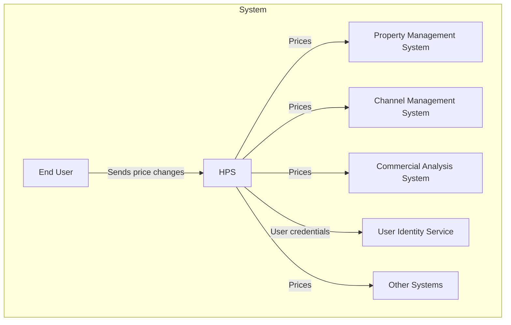

## 业务案例

AD&D Hotels是一家中等规模的商务连锁酒店（目前约有300家酒店），近年来一直经历强劲增长。公司的IT基础设施由许多不同的应用程序组成，如物业管理系统、商业分析系统、企业预订系统、渠道管理系统，而在这些系统的核心是酒店价格管理系统，如下图所示：

酒店价格管理系统的上下文图

酒店价格管理系统（HPS）被销售经理和商业代表用来为公司不同酒店的特定日期建立房价。价格与不同的费率相关联（例如公共费率或折扣费率），大多数不同费率的价格是通过采用基础费率并应用业务规则来计算的（尽管有些费率也可以是固定的，不依赖于基础费率）。经理通常会更改基础费率和固定费率的价格，利用这些信息，酒店价格管理系统会计算所有酒店所有房间的所有费率的价格，这些价格也会根据每家酒店可用的房型而变化。HPS计算的价格被公司其他系统用于预订，也通过渠道管理系统（CMS）发送给不同的在线旅行社。公司的系统托管在云提供商上，该提供商提供用户身份服务来管理用户并提供单点登录功能。

AD&D Hotels希望现代化其IT基础设施，第一步是完全替换现有的定价系统，该系统是几年前开发的，存在可靠性、性能、可用性和可维护性问题，这导致了财务损失。此外，公司遇到了困难，因为许多系统使用传统的SOAP和REST请求-响应端点连接：一个应用程序的更改经常影响其他应用程序，并使特定应用程序的单独更新部署变得复杂。此外，特定应用程序的故障可能会在整个系统中传播。而且，一些应用程序使用现在众所周知的反模式进行交互，如通过共享数据库进行集成。公司内部最近修订的企业架构原则要求系统向更解耦的模型迁移。

作为现代化工作的一部分，AD&D Hotels还希望在酒店价格系统的开发中集成敏捷（特别是Scrum）和DevOps实践。开发过程中的工件通过四个不同的环境：

- 开发：这是开发人员计算机上的本地环境
- 集成：这是云中的一个环境，在其中测试HPS的集成版本。在此环境中，系统未与所有外部系统连接，因此一些外部系统由模拟替代。
- 暂存：这是云中的一个环境，在部署前执行系统的最终测试（包括负载测试）。在这里，系统连接到所有外部系统的测试版本。在冲刺结束时，系统通常从这个环境中演示。
- 生产：这是真实世界的执行环境。

## 系统需求

需求获取活动之前已经进行，以下是收集到的最重要需求的摘要。

### 主要功能

酒店价格管理系统的功能在概念上很简单；系统的主用户故事在图8.2中使用用例图展示。

图8.2：酒店价格管理系统的初始用例图

每个用户故事在下表中描述：

|用户故事|描述|
|--|--|
|HPS-1：登录|用户（商业用户或管理员）在登录窗口中提供其凭据。系统根据用户身份服务检查这些凭据，如果成功，则提供对系统的访问权限。登录后，用户只能对已授权的酒店进行查询和更改。|
|HPS-2：更改价格|用户选择其有权更改价格的特定酒店，并选择他们想要更改基础费率或固定费率价格的特定日期。此时会计算从基础费率派生的所有费率的价格。系统允许在实际更改之前模拟价格更改。当价格更改时，它们会被推送到渠道管理系统，并可供外部系统查询。|
|HPS-3：查询价格|用户或外部系统通过用户界面或查询API查询给定酒店的价格。|
|HPS-4：管理酒店|管理员添加、更改或修改酒店信息。这包括编辑酒店的税率、可用费率和房型。|
|HPS-5：管理费率|管理员添加、更改或修改费率。这包括为不同费率定义计算业务规则。|
|HPS-6：管理用户|管理员更改给定用户的权限。|

### 质量属性场景

除了上述用例外，还获取并记录了许多质量属性场景。下表展示了其中七个最相关和重要的场景。对于每个场景，我们还确定了与之关联的用户故事。

| ID | 质量属性 | 场景 | 关联的用户故事 |
|---|---|---|---|
|QA-1|性能|在正常操作期间更改特定酒店和日期的基础费率价格，酒店所有费率和房型的价格在100毫秒内发布（准备查询）。|HPS-2|
|QA-2|可靠性|用户对给定酒店执行多次价格更改。100%的价格更改成功发布（可供查询）并且也被渠道管理系统接收。|HPS-2|
|QA-3|可用性|价格查询正常运行时间SLA必须在维护窗口外达到99.9%。|所有|
|QA-4|可扩展性|系统最初将通过其API支持每天至少10万次价格查询，并且应该能够处理多达100万次查询，而不会使平均延迟降低超过20%。|HPS-3|
|QA-5|安全性|用户通过前端登录系统。系统根据用户身份服务验证用户的凭据，登录后，仅向用户显示其有权使用的功能。|所有|
|QA-6|可修改性|系统中添加了使用不同于REST协议（例如gRPC）的价格查询端点。新端点不需要对系统的核心组件进行修改。|所有|
|QA-9|可测试性|系统及其元素的100%应支持独立于外部系统的集成测试|所有|
|QA-7|可部署性|在开发过程中，应用程序在非生产环境之间移动。不需要更改代码。|所有|
|QA-8|可监控性|系统操作员希望在运行期间测量价格发布的性能和可靠性。系统提供了一种机制，可以根据需要收集100%的这些度量。|HPS-2|

### 约束

最后，收集了一组关于系统及其实施的约束。这些约束在下表中展示。

| ID | 约束 |
|---|---|
|CON-1|用户必须通过Web浏览器在不同平台（Windows、OSX和Linux）和不同设备上与系统交互。|
|CON-2|通过云提供商身份服务管理用户并在云中托管资源。|
|CON-3|代码必须托管在公司其他项目已在使用的专有基于Git的平台上|
|CON-4|系统的初始版本必须在6个月内交付，但系统的初始版本（MVP）必须在最多2个月内向内部利益相关者展示。|
|CON-5|系统最初必须通过REST API与现有系统交互，但可能需要以后支持其他协议。|
|CON-6|设计系统时应优先考虑云原生方法。|

### 架构关注点

由于这是全新开发，最初只确定了少数一般关注点，如下表所示。

| ID | 关注点 |
|---|---|
|CRN-1|建立整体初始系统结构。|
|CRN-2|利用团队对Java技术和Angular框架的知识。|
|CRN-3|为开发团队成员分配工作。|
|CRN-4|避免引入技术债务|
|CRN-5|建立持续部署基础设施。|

## 优先级

确定的主要用户故事为：

* HPS-2：更改价格 - 因为它直接支持核心业务
* HPS-3：查询价格 - 因为它直接支持核心业务
* HPS-4：管理酒店 - 因为它为许多其他用户故事奠定了基础

HPS的场景优先级如下：

| 场景ID | 对客户的重要性 | 架构师认为的实现难度 |
| :---- | :---- | :---- |
| QA-1 - 性能 | 高 | 高 |
| QA-2 - 可靠性 | 高 | 高 |
| QA-3 - 可用性 | 高 | 高 |
| QA-4 - 可扩展性 | 高 | 高 |
| QA-5 - 安全性 | 高 | 中 |
| QA-6 - 可修改性 | 中 | 中 |
| QA-7 - 可部署性 | 中 | 中 |
| QA-8 - 可监控性 | 中 | 中 |
| QA-9 - 可测试性 | 中 | 中 |

从这个列表中，QA-1、QA-2、QA-3、QA-4和QA-5被选为主要驱动因素。